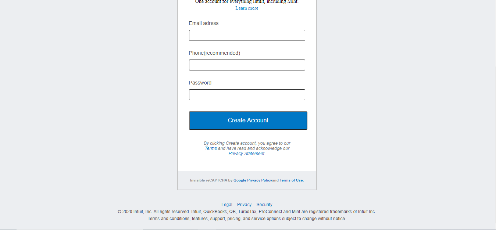
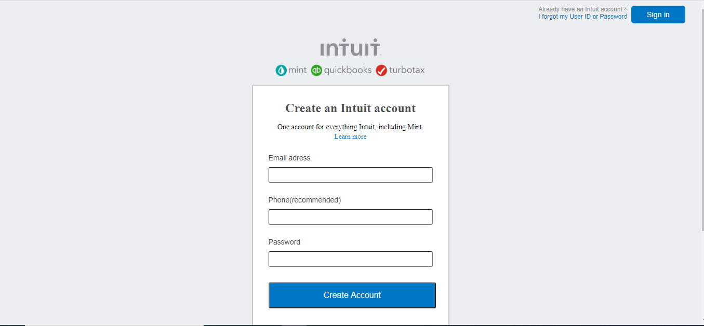

# SİGNUP FORM

## Live Server
https://rawcdn.githack.com/mcihadkurel/Signup-form/05108efcfd6c6385ea6ae07e51025889947e5da6/index.html
## Buit with
____________________________________________________
### HTML
____________________________________________________

<ul>
<li>The project contains some unordered lists</li>
<li>We used navbar for "Sign in" section.</li>
<li>Project has different label types</li>
</ul>

### &
### CSS
____________________________________________________
 <ul>
 <li>Footer element has line-height styling</li>
 <li>Form border has a bit radius</li>
 <li>Form elements has %100 width to border</li>
 </ul>
 
 

## Authors 
____________________________________________________
#### Muhammed Cihad Kurel
<ul>
<li>Github: [@mcihadkurel](https://github.com/mcihadkurel)</li>
<li>Twitter: [@mece_ka](https://twitter.com/mece_ka)</li>
<li>LinkedIn: [@muhammed](linkedin.com/in/muhammed-cihad-8187581a8/)</li>
</ul>
____________________________________________________

#### Nikolas Escobal
<ul>
<li>Github:[@nikoescobal](https://github.com/nikoescobal/Youtubeclone-muhammed-niko/commits?author=nikoescobal)</li>
<li>Twitter:[@nikoescobal](https://twitter.com/nikoescobal)</li>
<li>LinkedIn:[@nikolas-joseph-escobal](https://www.linkedin.com/in/nikolas-joseph-escobal/)</li>
</ul>
____________________________________________________

